# ATM or ATP or FTP ? 🤔 

> <p>Pradityo mencoba mengembangkan server ftp, tetapi seseorang mencoba melakukan bruteforce login, bisakah Anda menganalisis apa yang terjadi? </p>
> <p><a href="attachments/ftp.pcap">ftp.pcap</a></p>

## Path to Flag

Judul soal memberi petunjuk bahwa soal ini berkaitan dengan ftp, sehingga saya langsung display filter `ftp`. Kemudian melakukan sortir pada column time, dengan asumsi attempt terakhir merupakan attempt yang berhasil

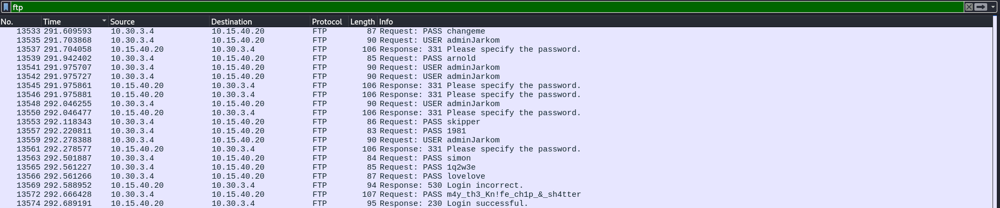<br>

Terlihat tulisan login successful dan saya langsung follow tcp streamnya

```
220 Welcome Alpine ftp server https://hub.docker.com/r/delfer/alpine-ftp-server/
USER adminJarkom
331 Please specify the password.
PASS m4y_th3_Kn!fe_ch1p_&_sh4tter
230 Login successful.
```

`adminJarkom:m4y_th3_Kn!fe_ch1p_&_sh4tter`

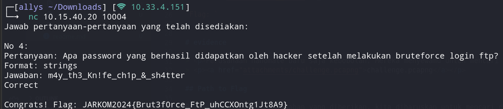<br>

`Flag: JARKOM2024{Brut3f0rce_FtP_uhCCXOntg1Jt8A9}`


# evidence 

> <p>Perusahaan nanomate baru saja kebobolan. Mereka menyewamu untuk mencari tahu bagaimana caranya pelaku bisa masuk.</p>
> <p><a href="attachments/challenge.pcapng">challenge.pcapng</a></p>

## Path to Flag

Berdasarkan validator jawaban yang diberikan, kita diharuskan untuk mencari domain milik korban, sehingga kita mencoba untuk filter http terlebih dahulu. Kita mencoba untuk melihat dari atas dan menemukan sebuah domain

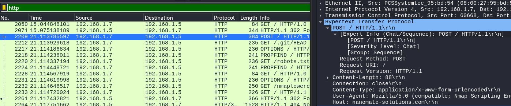<br>

`nanomate-solutions.com`

Selanjutnya adalah mencari web server dari domain tersebut, sehingga kita mencoba untuk follow http stream dari packet yang terdapat domain target

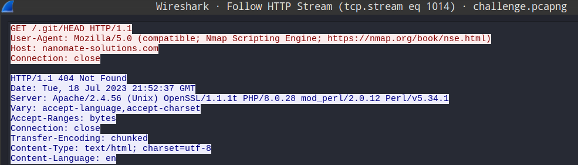<br>

`Apache/2.4.56`

Selanjutnya adalah mencari endpoint yang digunakan untuk login, terdapat 2 packet yang menarik jika dilihat secara langsung, yaitu `/app/includes/process_login.php` dan  `app/login.php`, tetapi jika kita follow http stream salah satu dari mereka, dapat dilihat bahwa `/app/login.php` merupakan referer sehingga dapat dipastikan `/app/includes/process_login.php` merupakan endpointnya.

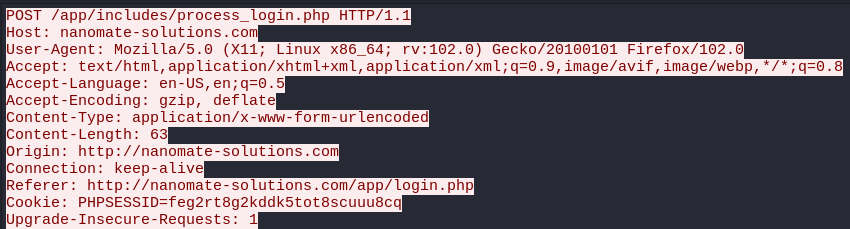<br>

Terakhir, untuk menemukan kredensial yang dipakai, kita menggunakan display filter `http and http.request.uri contains "/app/includes/process_login.php"`.

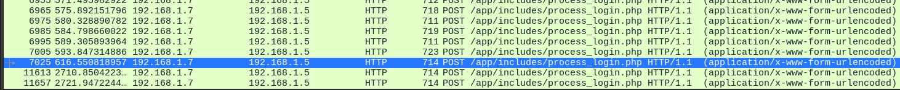<br>

2 packets paling akhir memiliki nomor packet yang jauh lebih besar (anomali), sehingga kita mencoba packet no. 7025.

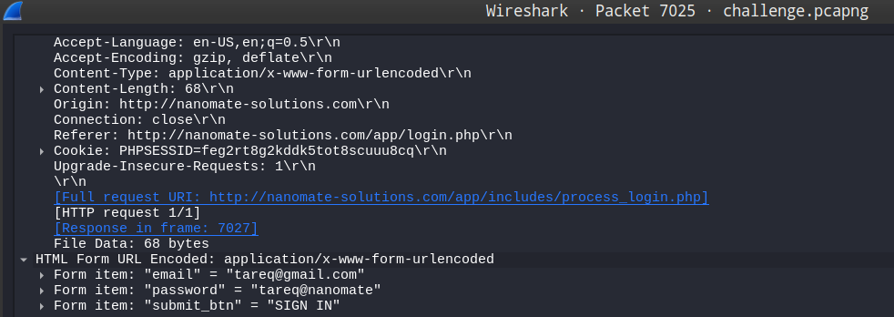<br>

`tareq@gmail.com:tareq@nanomate`

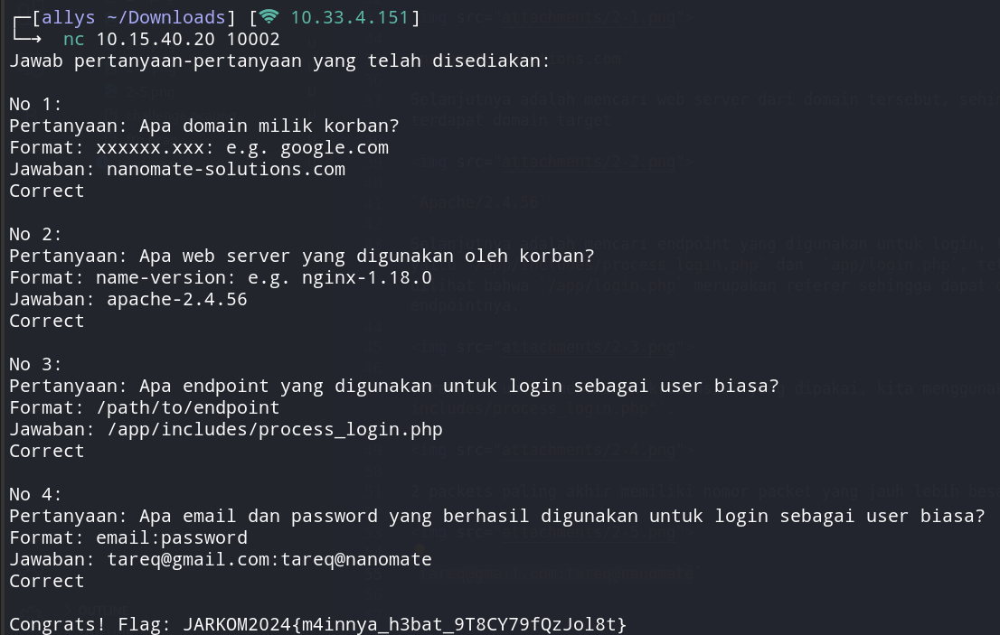<br>

`Flag : JARKOM2024{m4innya_h3bat_9T8CY79fQzJol8t}`

# How Many packets?

> <p>Sebagai kewajiban untuk laporan, aku diminta untuk mencari tahu berapa kali attempt login yang dilakukan oleh hacker. Dapatkah kamu membantuku untuk menganalisanya?</p>
> <p><a href="attachments/ftp.pcap">ftp.pcap</a></p>

## Path to Flag

Untuk menghitung jumlah attempt yang dilakukan oleh hacker, saya perlu lihat isi dari file `ftp.pcap` dan mencari informasi. Untuk mempermudah membacanya saya menggunakan filter `ftp`. Untuk membuat filternya semakin spesifik, dan setiap attempt yang dilakukan pasti akan dimintai password, saya menggunakan display filter `ftp.request.command == "PASS"` agar informasi yang ditampilkan hanya informasi yang berisikan attempt password oleh hacker.

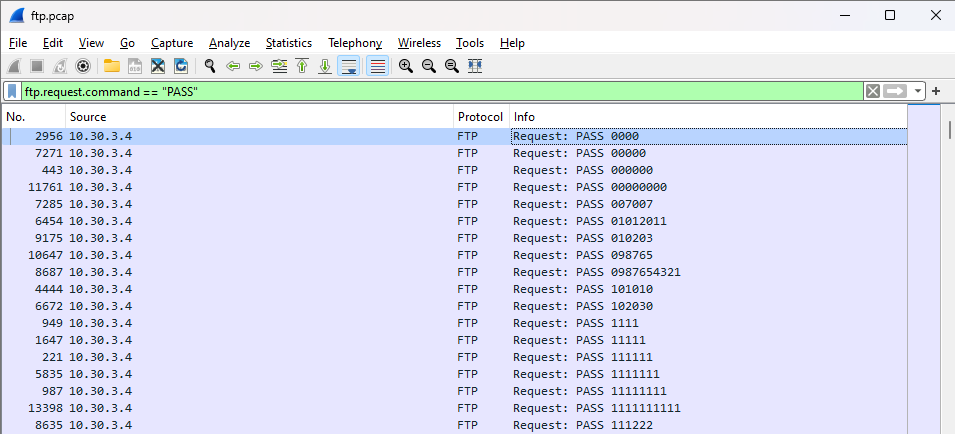<br>

Selanjutnya pada bagian pojok kanan bawah dapat kita lihat total displayed-nya, yaitu `934`.

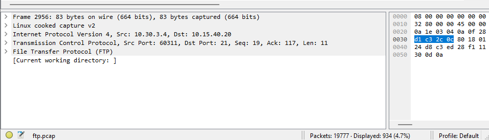<br>

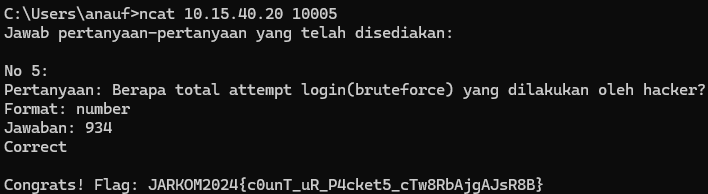<br>

`Flag: JARKOM2024{c0unT_uR_P4cket5_cTw8RbAjgAJsR8B}`

# trace him 

> <p>Selain menghitung jumlah packet, coba lacak juga ip penyerang tersebut!</p>
> <p><a href="attachments/ftp.pcap">ftp.pcap</a></p>

## Path to Flag
Pada soal sebelumnya saya sudah menggunakan filter `ftp.request.command == "PASS"` untuk melihat informasi mengenai attempt password yang dilakukan oleh penyerang. Dengan filter tersebut juga saya dapat melihat IP `source` dari penyerang.

<br>

Pada bagian `source` terlihat semua attempt serangan berasal dari IP `10.30.3.4`

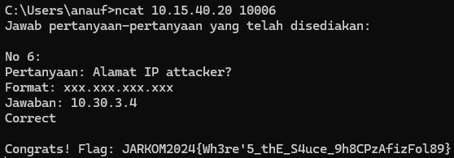<br>

`Flag: JARKOM2024{Wh3re'5_thE_S4uce_9h8CPzAfizFol89}`

# creds 

> <p>Attacker menyadari jika dia bisa membuat clone ftp server dari target, temukan kredensialn dari server ftp yang dibuat oleh attacker</p>
> <p><a href="attachments/evidence.pcap">evidence.pcap</a></p>

## Path to Flag

Deskripsi soal mengarah kepada ftp connection, jadi kita langsung display filter ftp, sekaligus mendapatkan sebuah credential yang valid

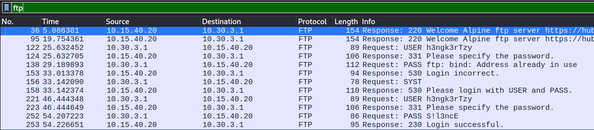

`h3ngk3rTzy:S!l3ncE`

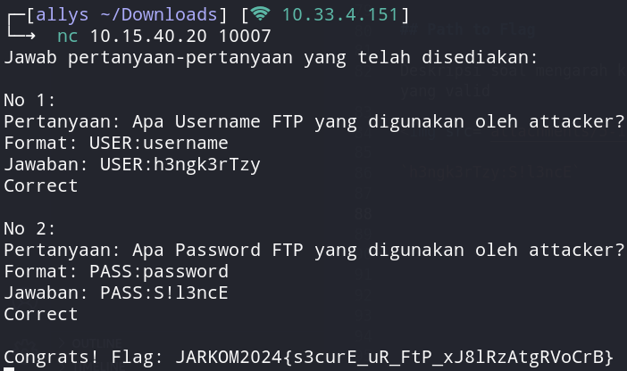<br>

`Flag: JARKOM2024{s3curE_uR_FtP_xJ8lRzAtgRVoCrB}`

# malwleowleo

> <p>Dapatkah kamu menemukan file malware yang dikirim oleh attacker melalui ftp?</p>
> <p><a href="attachments/evidence.pcap">evidence.pcap</a></p>

## Path to Flag

Melanjutkan soal creds, kita langsung connect dengan server ftp dengan host 10.15.40.20 menggunakan command `ftp 10.15.40.20` dan input username dan password yang sudah ditemukan sebelumnya.

<br>

Kita juga melakukan `ls` untuk mengetahui file apa saja yang berada di dalam server ftp tersebut.

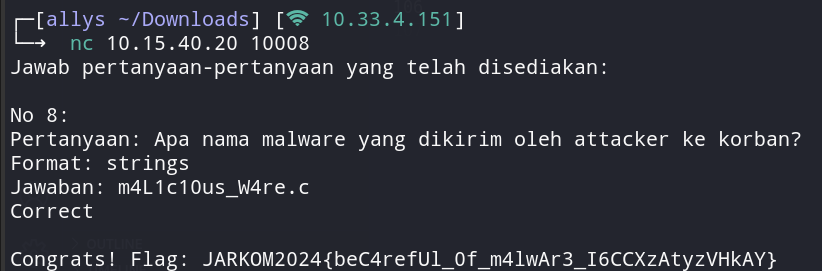<br>

`Flag: JARKOM2024{beC4refUl_0f_m4lwAr3_I6CCXzAtyzVHkAY}`

# fuzz

> <p>My website got hacked. Can you analyze this network traffic to help me track the attacker?</p>
> <p><a href="attachments/capture.pcap">capture.pcap</a></p>

## Path to Flag

Pertama, kita diminta untuk mencari IP address milik attacker.

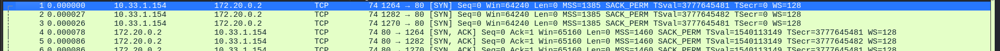<br>

Secara langsung, kita berasumsi bahwa IP address attacker adalah `10.33.1.154` karena IP tersebut yang sering mengirim packet SYN, sedangkan `127.20.0.2` hanya acknowledge packet SYN tersebut diketahui dari packet SYN ACK dari IP tersebut sehingga dapat diasumsikan IP tersebut merupakan IP korban.

Berdasarkan network traffic tersebut, attacker melakukan koneksi ke port 80 dari korban

Selanjutnya, kita mencari endpoint dari login, jadi kita langsung mencoba untuk follow stream dan mendapatkan path root

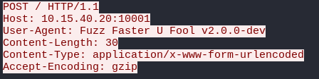<br>

Terlebih lagi, dapat ditemukan sesuatu yang mencurigakan yaitu, tools yang digunakan untuk melakukan fuzzing yaitu `Fuzz Faster U Fool v2.0.0-dev`. Setelah melakukan sanity check, kita mengetahui bahwa yang diperlukan adalah singkatannya, sehingga tools yang dipakai attacker adalah `ffuf-v2.0.0-dev`

Terakhir, kita diminta untuk mencari username dan password yang berhasil digunakan oleh attacker.
Menggunakan display filter, kita mencoba untuk melakukan screening dan menemukan sesuatu yang unique.

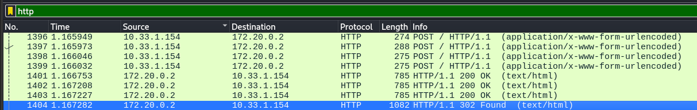<br>

Kita langsung follow stream dan mendapatkan username dan password yang berhasil digunakan oleh attacker.

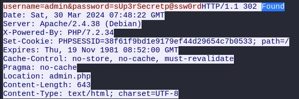<br>

`admin:sUp3rSecretp@ssw0rd`

<br>

`Flag: JARKOM2024{s3m4ng4t_ya_<3_chfCXcAjg6ksR8B}`

# Revisi

## whoami

> <p>Dapatkah kamu menemukan siapa identitas attacker?</p>
> <p><a href="attachments/evidence.pcap">evidence.pcap</a></p>

### Path to Flag

Kita menggunakan display filter ftp dan mencoba untuk follow tcp stream dari response yang berhasil login

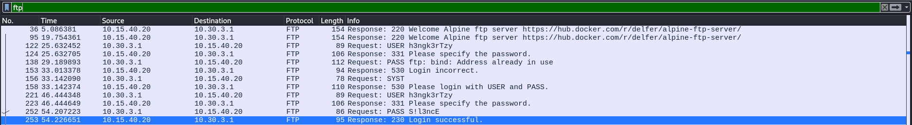<br>

Lalu, kita mencoba untuk mengecek value maksimal dari tcp.stream, yang dimana ternyata hanya sampai `tcp.stream eq 14` dan kita tidak mendapatkan clue apapun, jadi kita mencoba untuk secara manual mengecek payload tiap packet yang memiliki protocol berhubungan dengan FTP (FTP / FTP-DATA). Kita mendapatkan sebuah base64 encoded string.

```
echo "SGVsbG8gbXkgbmFtZSBpcyBQYXVsIEF0cmVpZGVzCg==" | base64 -d
Hello my name is Paul Atreides
```

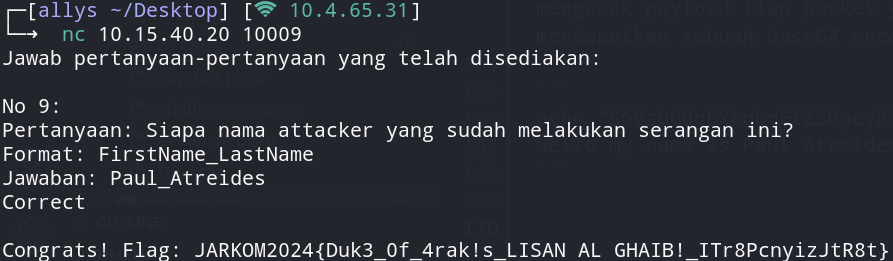<br>

`Flag: JARKOM2024{Duk3_0f_4rak!s_LISAN AL GHAIB!_ITr8PcnyizJtR8t}`<br>

## secret
> <p>Temukan pesan rahasia dari attacker</p>
> <p><a href="attachments/evidence.pcap">evidence.pcap</a></p>

### Path to Flag
Awalnya no clue, tapi selain ada C file malware, terdapat juga gambar dengan file name `mirza.jpg`
<br>

Jadi kita mencoba untuk memasukkan kata kunci `MIO MIRZA`

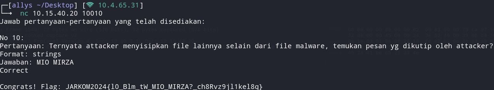<br>

`Flag: JARKOM2024{l0_Blm_tW_MIO_MIRZA?_ch8Rvz9jl1kel8q}`

## malwaew
> <p>Ini adalah network traffic dari salah satu komputer di DPSSI yang terkena malware. Pak Sunhi, memintamu untuk membantu menganalisisnya. Bantulah Pak Sunhi untuk menemukan malware tersebut.

note: Network traffic berikut mengandung malware asli. #DYOR Attachment: </p>
> <p><a href="attachments/infected.zip">infected.zip</a></p>

### Path to Flag
No clue sebelum hint turun, tetapi telat menyadari fungsi hint `decrypt tls first`.
Dibutuhkan SSLKEYLOGFILE yang ternyata merupakan file txt yang diberikan dengan filename `keylog.txt`.
Kemudian, dengan memasukan keylog.txt yang telah diberikan ke dalam pre-shared key yang ada di menu `preferences`

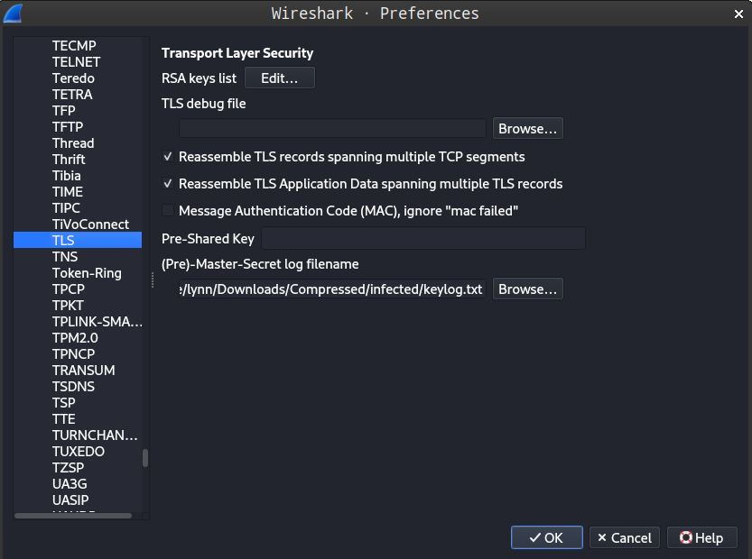<br>

karena terdapat kata tls di soal, jadi kita mencoba untuk display filter `tls` dan menemukan 2 jenis protocol, yaitu `TLSv1.2` dan `HTTP`.

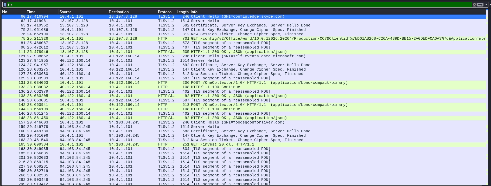<br>

sehingga kita mencoba untuk `export object HTTP` dan save file yang bernama `invest_20.dll` karena hanya file itu yang mencurigakan sebagai malware.

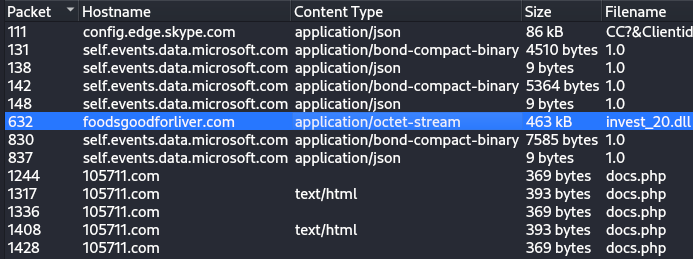<br>

Kemudian, mendapatkan sha256 hash dari `invest_20.dll`

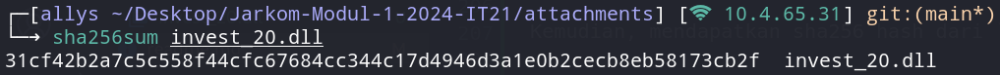<br>

`SHA256 Hash invest_20.dll: 31cf42b2a7c5c558f44cfc67684cc344c17d4946d3a1e0b2cecb8eb58173cb2f`

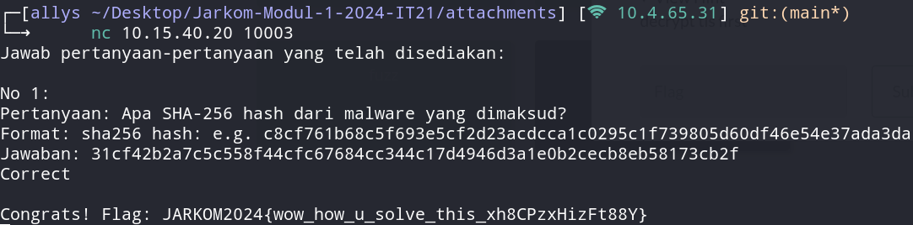<br>

`Flag: JARKOM2024{wow_how_u_solve_this_xh8CPzxHizFt88Y}`


